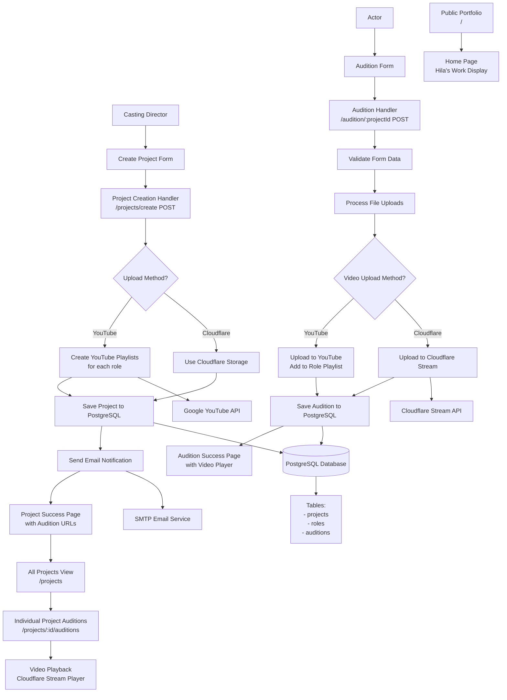
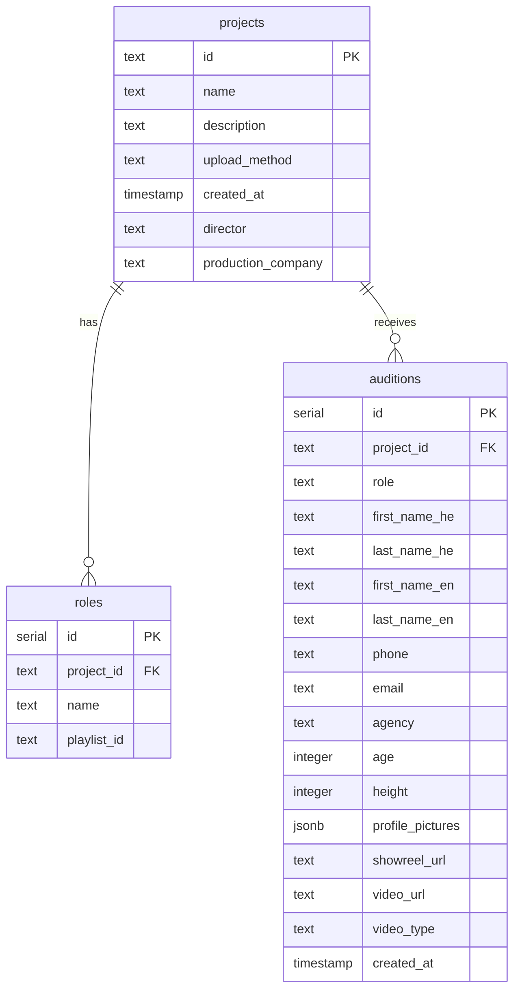

# Hila Yuval Casting Platform - Application Workflow Diagram

## Overview
This is a casting management platform that allows casting directors to create projects and receive audition submissions from actors.

## Application Architecture

## Database Schema

## Key Application Routes

### Public Routes
- `GET /` - Portfolio/Home page displaying Hila's work
- `GET /audition/:projectId` - Project-specific audition form
- `POST /audition/:projectId` - Submit audition for specific project

### Management Routes
- `GET /projects/create` - Create new casting project form
- `POST /projects/create` - Handle project creation
- `GET /projects` - List all projects with search/filter
- `GET /projects/:id/edit` - Edit project details
- `POST /projects/:id/add-role` - Add new role to project
- `GET /projects/:id/auditions` - View all auditions for project

### Authentication Routes
- `GET /auth/google` - Initiate Google OAuth for YouTube
- `GET /oauth2callback` - Handle OAuth callback

## Technology Stack

### Backend
- **Node.js/Express** - Web server framework
- **PostgreSQL** - Primary database (Heroku Postgres)
- **Handlebars** - Template engine
- **Multer** - File upload handling

### External Services
- **Google YouTube API** - Video upload and playlist management
- **Cloudflare Stream** - Video hosting and streaming
- **Nodemailer/SMTP** - Email notifications
- **Heroku** - Cloud hosting platform

### Frontend
- **Bootstrap 5** - CSS framework
- **Handlebars templates** - Server-side rendering
- **Custom CSS** - Red-themed styling for Hila's brand

## Key Features

1. **Dual Video Upload Methods**
   - YouTube: Public playlists for each role
   - Cloudflare Stream: Private video hosting

2. **Multi-language Support**
   - Hebrew and English name fields
   - Right-to-left text support

3. **File Management**
   - Profile picture uploads via Cloudflare Images
   - Video file processing and upload to Cloudflare Stream or YouTube

4. **Search and Filtering**
   - Search auditions by name, email, role
   - Filter across all projects

5. **Responsive Design**
   - Mobile-friendly audition forms
   - Video player with loading states

## Error Handling
- Comprehensive try-catch blocks
- Custom error handler middleware
- Detailed logging for debugging
- Graceful fallbacks for API failures

## Deployment
- Heroku cloud platform
- Environment-based configuration
- Database migrations support
- Custom deployment scripts
